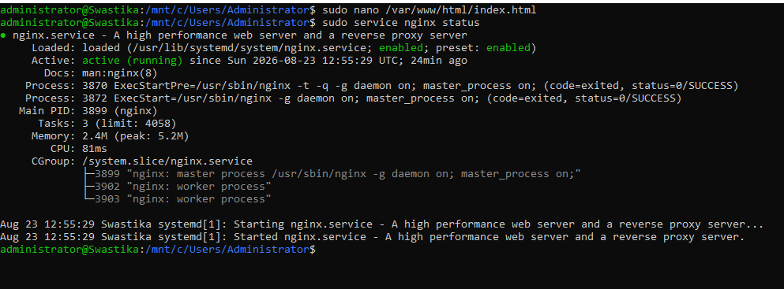
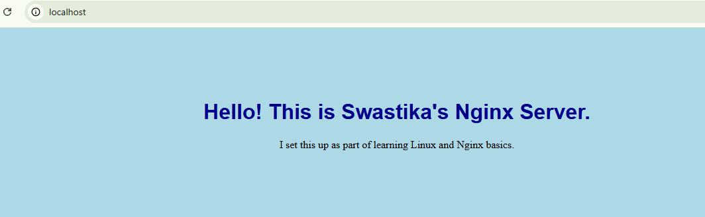

# Linux + Nginx Web Server Project

A beginner project where I installed and configured Nginx web server on Linux (via WSL/Ubuntu), and served a custom HTML page styled with CSS.

## What I Did

1. Installed Nginx using: 'sudo apt install nginx -y'
2. Started the Nginx service: 'sudo service nginx start'
3. Verified it was running: 'sudo service nginx status'
4. Visited http://localhost' in my browser and confirmed the default Nginx page loaded
5. Edited the default page ('/var/www/html/index.html') using 'nano' to replace it with my own custom HTML
6. Created a 'style.css' file to style the page (background color, text color, layout)
7. Linked the CSS file inside 'index.html' using '<link rel="stylesheet" href="style.css">'
8. Refreshed the browser and confirmed my styled custom page appeared

## Screenshots

**Nginx running status:**

**Custom styled webpage in browser:**

## What I Learned

- What a web server is and how Nginx serves webpages
- Installing and managing services on Linux ('apt', 'service')
- Basic Linux file editing using 'nano'
- Writing simple HTML and linking a CSS stylesheet to it
- The concept of 'localhost' and how a browser communicates with a local server

## Tools Used

- WSL (Windows Subsystem for Linux) running Ubuntu
- Nginx
- HTML & CSS
- Nano text editor